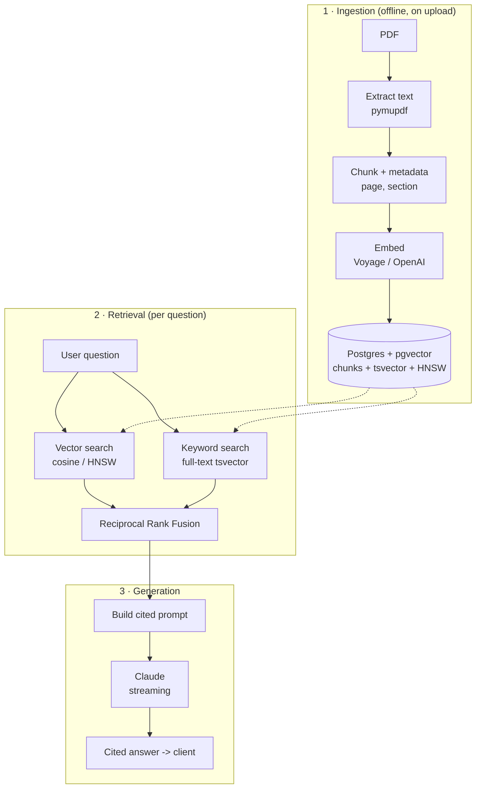

# Architecture

The system is three independent pipelines. Keeping them separate means when an
answer is bad you can ask *which stage* failed — retrieval or generation —
instead of guessing.

## Data model
- **documents** — one row per PDF (filename, title, page_count, metadata).
- **chunks** — one row per chunk: content, `embedding vector(1024)`, page_number,
  section, and a generated `content_tsv` for full-text search. HNSW index on the
  embedding, GIN index on the tsvector.

## Request flow
- `POST /upload` → ingestion pipeline → rows in `documents` + `chunks`.
- `POST /chat` → hybrid retrieval → cited, streamed generation.

## Why hybrid
Vector search handles paraphrase ("thermal performance" ≈ "U-values"); keyword
search nails exact strings ("Part L", "Approved Document B"). RRF fuses both.
The comparison lives in `scripts/evaluate.py`.
